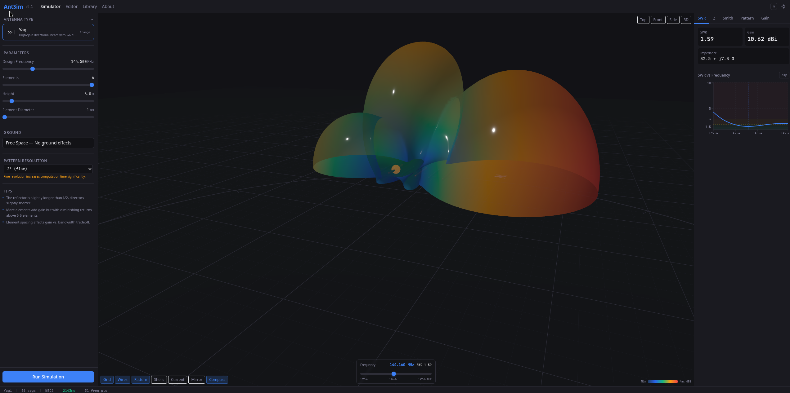
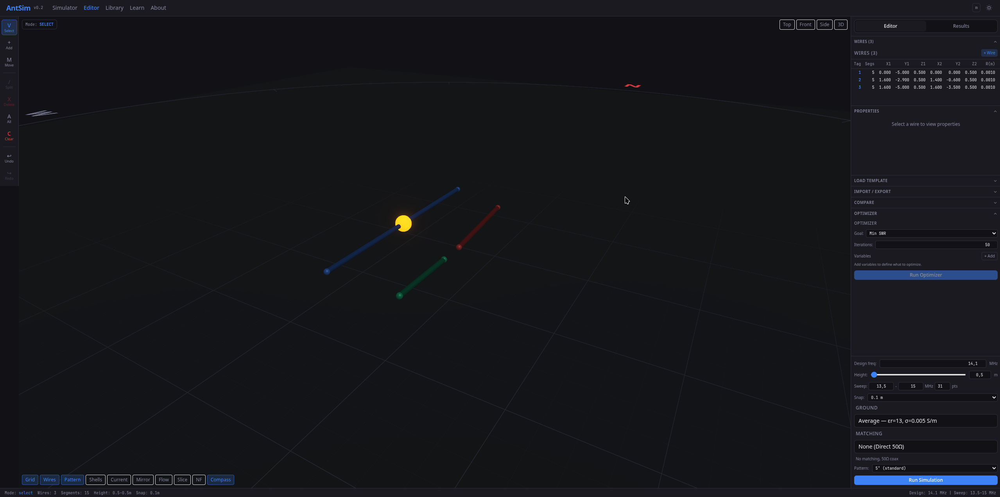

<p align="center">
  
  
  
  
  
</p>

# AntennaSim

**A free, open-source, web-based amateur radio antenna simulator powered by the NEC2 electromagnetic engine.**

Design antennas from 17 built-in templates or build your own from scratch in the wire editor. Run NEC2 simulations and instantly visualize SWR, impedance, Smith chart, 3D radiation patterns, current distribution, and near-field heatmaps -- all in your browser.

No installation required. Just `docker compose up` and go.

---

<p align="center">
  
</p>
<p align="center">
  
</p>

---

## Table of Contents

- [Features](#features)
- [Antenna Templates](#antenna-templates)
- [Quick Start](#quick-start)
- [Development Setup](#development-setup)
- [Production Deployment](#production-deployment)
- [Architecture](#architecture)
- [Project Structure](#project-structure)
- [API Reference](#api-reference)
- [Configuration](#configuration)
- [Keyboard Shortcuts](#keyboard-shortcuts)
- [Tech Stack](#tech-stack)
- [Contributing](#contributing)
- [License](#license)
- [Acknowledgments](#acknowledgments)

---

## Features

### Simulation Engine

- **Full NEC2 pipeline** -- geometry definition to card deck generation to `nec2c` execution to parsed results, all automated
- **Frequency sweep** -- simulate across any frequency range with configurable step size
- **10 ground models** -- free space, perfect ground, salt water, fresh water, pastoral, average, rocky, city, dry/sandy, and custom (user-defined dielectric constant and conductivity)
- **Lumped loads** -- series RLC, parallel RLC, fixed impedance, and wire conductivity (copper, aluminum, steel, stainless steel)
- **Transmission lines** -- characteristic impedance, length, velocity factor, and shunt admittance
- **GA/GM/GR cards** -- wire arcs, coordinate transformations, and cylindrical symmetry for complex geometries
- **Redis caching** -- simulation results cached with SHA-256 keys and zlib compression (1h TTL)
- **Rate limiting** -- opt-in, configurable (default: 30/hour, 5 concurrent per IP when enabled)
- **Sandboxed execution** -- `subprocess.run(shell=False, timeout=180)`, isolated temp dirs, non-root container

### Interactive 3D Viewport

- **Real-time 3D rendering** -- pan, rotate, zoom with orbit controls
- **Radiation pattern** -- 3D surface mesh with perceptually uniform colormap (gain in dBi)
- **Volumetric shells** -- alternative multi-shell pattern visualization
- **Current distribution** -- wire segments colored by current magnitude with hot colormap
- **Animated current flow** -- luminous particles traveling along wires proportional to current
- **Near-field heatmap** -- E-field magnitude as a semi-transparent plane in 3D
- **Pattern slice** -- animated cutting plane sweeping through the radiation pattern
- **Ground reflection** -- ghost mirror showing antenna image below ground plane
- **Hover measurements** -- tooltip follows cursor over any 3D object showing gain, wire dimensions, current magnitude, or field strength
- **Auto-framing** -- camera automatically fits to antenna bounding box on load and template change
- **3D orientation gizmo** -- interactive axis cube in the viewport corner; click any face/edge/corner to snap to that camera angle
- **Compass rose** for spatial orientation

### Charts & Analysis

- **SWR vs. Frequency** -- color-coded zones (green/amber/red), ham band markers, resonance annotation, crosshair tooltips
- **Impedance (R + jX)** -- resistance and reactance curves, reference impedance line, resonance crossings where jX=0
- **Smith Chart** -- impedance locus with frequency markers, constant SWR circles (1.5, 2.0, 3.0), click-to-inspect tooltip showing Z, SWR, and reflection coefficient
- **Polar Radiation Pattern** -- azimuth (H-plane) and elevation (E-plane) cuts, -3dB beamwidth arc, max gain marker, concentric dBi grid
- **Chart popups** -- click any chart to expand to a full-screen modal for detailed analysis
- **Legends** -- every chart includes a clear legend explaining all colors, lines, and markers
- **Balun/Unun matching** -- client-side impedance transformation with 10 presets (1:1 to 49:1) for viewing SWR relative to transformed impedance
- **.s1p overlay** -- import NanoVNA measurement data and overlay on simulation SWR for comparison

### Wire Editor

- **Build from scratch** -- click-to-add wires, drag endpoints, snap grid
- **Move mode** -- drag endpoints or entire wires; Shift+drag for vertical-only movement
- **Undo/Redo** -- full history with Ctrl+Z / Ctrl+Shift+Z
- **Wire properties** -- edit coordinates, radius, segments per wire
- **Excitations** -- set feed points with magnitude and phase
- **Loads & transmission lines** -- add lumped RLC loads and TL models to any segment
- **Templates** -- load any built-in template into the editor and modify it
- **Import/Export** -- open and save `.nec` (NEC2 card deck) and `.maa` (MMANA-GAL) files

### Optimizer

- **Nelder-Mead** algorithm (scipy, adaptive mode)
- **5 objective functions** -- minimize SWR (single freq), minimize SWR (band average), maximize gain, maximize front-to-back ratio, weighted combined
- **Up to 10 variables** with min/max bounds
- **Real-time progress** -- WebSocket streaming of iteration count, current best SWR, convergence chart
- **Cancel** -- abort optimization mid-run

### Other

- **17 antenna templates** spanning wire, vertical, multiband, loop, and directional categories
- **Template library page** -- browse and compare all templates with descriptions and difficulty ratings
- **Learn page** -- educational content on NEC2, SWR, impedance, radiation patterns, and simulation tips
- **Mobile responsive** -- usable on phones and tablets with touch-friendly controls
- **Dark/Light theme** -- system-aware with manual toggle
- **Keyboard shortcuts** -- 17 bindings for fast workflow (press `?` to see them all)

---

## Antenna Templates

AntennaSim ships with **17 ready-to-simulate templates** organized by category:

| Category | Templates |
|---|---|
| **Wire** | Half-Wave Dipole, Inverted V, End-Fed Half-Wave |
| **Vertical** | Ground Plane Vertical, J-Pole, Slim Jim |
| **Multiband** | Off-Center Fed Dipole, G5RV, Fan Dipole |
| **Loop** | Delta Loop, Horizontal Delta Loop, Cubical Quad, Small Magnetic Loop |
| **Directional** | Yagi-Uda (2-6 el.), Moxon Rectangle, Hex Beam, Log-Periodic Dipole Array |

Every template includes configurable parameters (frequency, height, element lengths, spacing, wire diameter, etc.) with sensible defaults and validation ranges.

---

## Quick Start

### Prerequisites

- [Docker](https://docs.docker.com/get-docker/) and [Docker Compose](https://docs.docker.com/compose/install/) (v2+)
- That's it. No Python, Node.js, or nec2c installation needed.

### One-liner (Docker Hub)

```bash
docker run -p 80:80 ea1fuo/antennasim
```

Open **http://localhost** in your browser. Done. This pulls the all-in-one image from Docker Hub with everything bundled (frontend, backend, Redis, nginx).

### From source

```bash
git clone https://github.com/EA1FUO/AntennaSim.git
cd AntennaSim
cp .env.example .env
docker compose up --build
```

The first build takes a few minutes (downloading base images, compiling nec2c, installing dependencies). Subsequent starts are fast.

---

## Development Setup

For active development with hot-reload on both frontend and backend:

```bash
# Clone and configure
git clone https://github.com/EA1FUO/AntennaSim.git
cd AntennaSim
cp .env.example .env

# Start with base + dev overrides (same behavior as ./scripts/dev.sh)
docker compose -f docker-compose.yml -f docker-compose.dev.yml up --build
```

Or use the dev script:

```bash
./scripts/dev.sh
```

| Service | URL | Hot-reload |
|---|---|---|
| Frontend | http://localhost:5173 | Yes (Vite HMR) |
| Backend API | http://localhost:8000 | Yes (Uvicorn --reload) |
| API Docs (Swagger) | http://localhost:8000/docs | -- |
| Redis | localhost:6379 | -- |

Source directories are volume-mounted so changes are reflected immediately:
- `frontend/src/` -- React components, pages, stores
- `backend/src/` -- FastAPI endpoints, simulation runner, parsers

---

## Production Deployment

### Docker Compose (recommended)

```bash
# On your VPS/server:
git clone https://github.com/EA1FUO/AntennaSim.git
cd AntennaSim
cp .env.example .env

# Edit .env for production:
# - Set ENVIRONMENT=production
# - Set ALLOWED_ORIGINS to your domain
# - Adjust resource limits as needed

docker compose up -d --build
```

The production stack includes:
- **nginx** reverse proxy on ports 80/443 with gzip, security headers, and WebSocket support
- **Frontend** served as static files (Vite build)
- **Backend** with resource limits (2 CPU, 512MB RAM), read-only filesystem, `no-new-privileges`
- **Redis** with 128MB LRU cache

### SSL/HTTPS

The nginx config is ready for SSL. To enable:

1. Obtain certificates (e.g., via [Certbot](https://certbot.eff.org/) / Let's Encrypt)
2. Mount certificates into the nginx container
3. Uncomment the SSL server block in `nginx/nginx.conf`
4. Set port 443 in `docker-compose.yml`

### Resource Requirements

| Resource | Minimum | Recommended |
|---|---|---|
| CPU | 1 core | 2+ cores |
| RAM | 512 MB | 1 GB |
| Disk | 500 MB | 1 GB |
| OS | Any with Docker | Linux (amd64) |

---

## Architecture

```
                         +----------+
                         |  Browser |
                         +----+-----+
                              |
                         HTTP / WS
                              |
                    +---------+---------+
                    |      nginx        |
                    |   reverse proxy   |
                    |   :80 / :443      |
                    +---------+---------+
                         /          \
                        /            \
              +--------+--+    +-----+------+
              | Frontend  |    |  Backend   |
              | React SPA |    |  FastAPI   |
              | :80 (prod)|    |  :8000     |
              | :5173(dev)|    +-----+------+
              +-----------+          |
                                     |    +--------+
                                     +----+ Redis  |
                                     |    | :6379  |
                                     |    +--------+
                                     |
                                +----+----+
                                | nec2c   |
                                | engine  |
                                +---------+
```

**Data flow:** User configures antenna in the browser -> React generates NEC2 card deck -> POST to FastAPI -> backend writes `.nec` file, runs `nec2c` subprocess -> output parsed into structured JSON -> results cached in Redis -> response sent to frontend -> charts and 3D viewport update.

---

## Project Structure

```
AntennaSim/
|-- frontend/                   # React 19 + TypeScript + Vite
|   |-- src/
|   |   |-- components/
|   |   |   |-- three/          # 3D viewport (R3F): antenna, pattern, current, NF, raycaster
|   |   |   |-- editors/        # Template parameter editor, wire editor, balun editor
|   |   |   |-- results/        # Charts: SWR, impedance, Smith, polar, gain table
|   |   |   |-- ui/             # Reusable primitives: tabs, modals, chart popups
|   |   |   |-- layout/         # App shell, panels, responsive wrappers
|   |   |   +-- common/         # Shared utilities, keyboard shortcuts
|   |   |-- hooks/              # Custom hooks (chart theme, debounce, etc.)
|   |   |-- stores/             # Zustand stores (antenna, simulation, editor, UI, compare)
|   |   |-- templates/          # 17 antenna template definitions
|   |   |-- engine/             # Client-side NEC card generation & validation
|   |   |-- utils/              # Units, formatting, .s1p parser, matching
|   |   |-- pages/              # Route pages (Simulator, Editor, Library, Learn, About)
|   |   +-- api/                # API client (fetch + WebSocket)
|   |-- Dockerfile              # Production: multi-stage build -> nginx static
|   +-- Dockerfile.dev          # Development: Vite dev server with HMR
|
|-- backend/                    # Python 3.12 + FastAPI
|   |-- src/
|   |   |-- api/v1/             # REST + WebSocket endpoints
|   |   |-- simulation/         # NEC runner, output parser, optimizer, cache
|   |   |-- models/             # Pydantic models (antenna, simulation, results)
|   |   +-- converters/         # .maa / .nec import and export
|   |-- Dockerfile              # Production: python:3.12-slim + nec2c
|   +-- Dockerfile.dev          # Development: uvicorn --reload
|
|-- nginx/                      # Reverse proxy
|   |-- nginx.conf              # Proxy rules, gzip, security headers, WebSocket
|   +-- Dockerfile              # nginx:alpine
|
|-- deploy/
|   +-- allinone/               # All-in-one Docker image support files
|       |-- supervisord.conf    # Manages redis, uvicorn, nginx processes
|       +-- nginx.conf          # Serves frontend + proxies /api/ to uvicorn
|
|-- .github/workflows/
|   |-- ci.yml                  # Lint, type-check, build on PRs and pushes to main
|   |-- pr-title.yml            # Validates Conventional Commits format on PR titles
|   +-- docker-publish.yml      # Builds and pushes Docker images on version tags
|
|-- scripts/
|   +-- dev.sh                  # Start development environment
|
|-- VERSION                     # Single source of truth for app version (e.g. 0.6.0)
|-- Dockerfile                  # All-in-one image: frontend + backend + redis + nginx
|-- docker-compose.yml          # Production stack (4 services)
|-- docker-compose.dev.yml      # Development overrides (hot-reload, exposed ports)
|-- .env.example                # Environment variable template
|-- LICENSE                     # GPL-3.0
+-- README.md                   # You are here
```

---

## API Reference

All endpoints are under `/api/v1/`. Interactive Swagger docs available at `/docs` when the backend is running.

### `POST /api/v1/simulate`

Run a NEC2 simulation.

**Request body:**
```json
{
  "wires": [
    { "tag": 1, "segments": 21, "x1": 0, "y1": -5.05, "z1": 10,
      "x2": 0, "y2": 5.05, "z2": 10, "radius": 0.001 }
  ],
  "excitations": [
    { "wire_tag": 1, "segment": 11, "real": 1.0, "imag": 0.0 }
  ],
  "ground": { "type": "average" },
  "frequency": { "start_mhz": 13.5, "end_mhz": 15.0, "steps": 31 },
  "compute_currents": true,
  "near_field": {
    "enabled": true,
    "plane": "horizontal",
    "height_m": 1.8,
    "extent_m": 20,
    "resolution_m": 0.5
  }
}
```

**Response:** Full simulation results including impedance, SWR, gain, radiation pattern, per-segment currents, and near-field data for every frequency point.

### `POST /api/v1/optimize`

Run parameter optimization (synchronous).

### `WebSocket /api/v1/ws/optimize`

Real-time optimizer progress streaming. Sends JSON frames with iteration number, current best SWR, parameter values, and convergence status.

### `POST /api/v1/convert/import`

Import antenna definitions from `.maa` or `.nec` files. Upload the file as form data, receive structured JSON.

### `POST /api/v1/convert/export`

Export antenna data to `.maa` or `.nec` format. Send JSON, receive the file.

### `GET /api/v1/health`

Health check. Returns nec2c availability, Redis status, app version, and environment.

---

## Configuration

Copy `.env.example` to `.env` and adjust:

```bash
# Backend
ENVIRONMENT=development          # development | production
ALLOWED_ORIGINS=http://localhost:5173  # CORS origins (comma-separated)
REDIS_URL=redis://redis:6379     # Redis connection
LOG_LEVEL=debug                  # debug | info | warning | error
SIM_TIMEOUT_SECONDS=180          # Per-simulation timeout (seconds)
NEC_WORKDIR=/tmp/nec_workdir     # Temp directory for .nec files

# Rate limiting (opt-in, disabled by default)
RATE_LIMIT_ENABLED=false         # Set to true for public deployments
RATE_LIMIT_PER_HOUR=30           # Max simulations per IP per hour
MAX_CONCURRENT_PER_IP=5          # Max concurrent simulations per IP

# Frontend (Vite)
VITE_API_URL=http://localhost:8000   # Backend URL
VITE_WS_URL=ws://localhost:8000      # WebSocket URL
```

---

## Keyboard Shortcuts

Press `?` anywhere in the app to see the full shortcuts panel.

### Simulator

| Key | Action |
|---|---|
| `Ctrl + Enter` | Run simulation |
| `Scroll` | Zoom |
| `Left drag` | Rotate |
| `Right drag` | Pan |

### Wire Editor

| Key | Action |
|---|---|
| `V` | Select mode |
| `A` | Add wire mode |
| `M` | Move mode |
| `Ctrl + Z` | Undo |
| `Ctrl + Shift + Z` | Redo |
| `Ctrl + A` | Select all |
| `Delete` | Delete selected |
| `Escape` | Deselect all |

---

## Tech Stack

### Frontend

| Technology | Version | Purpose |
|---|---|---|
| [React](https://react.dev) | 19 | UI framework |
| [TypeScript](https://www.typescriptlang.org) | 5.7 | Type safety (strict mode) |
| [Vite](https://vite.dev) | 6 | Build tool with HMR |
| [Tailwind CSS](https://tailwindcss.com) | 3.4 | Utility-first styling |
| [React Three Fiber](https://r3f.docs.pmnd.rs) | 9.5 | Declarative Three.js |
| [Three.js](https://threejs.org) | 0.170 | 3D rendering engine |
| [Zustand](https://zustand.docs.pmnd.rs) | 5.0 | State management |
| [Recharts](https://recharts.org) | 2.14 | Chart library |

### Backend

| Technology | Version | Purpose |
|---|---|---|
| [Python](https://python.org) | 3.12 | Runtime |
| [FastAPI](https://fastapi.tiangolo.com) | 0.115+ | Web framework |
| [Pydantic](https://docs.pydantic.dev) | 2.10+ | Data validation |
| [nec2c](https://www.pa3fwm.nl/software/nec2c/) | -- | NEC2 engine (C port) |
| [SciPy](https://scipy.org) | 1.14+ | Nelder-Mead optimizer |
| [Redis](https://redis.io) | 7 | Result caching |

### Infrastructure

| Technology | Purpose |
|---|---|
| [Docker](https://docker.com) | Containerization |
| [Docker Compose](https://docs.docker.com/compose/) | Multi-service orchestration |
| [nginx](https://nginx.org) | Reverse proxy, SSL termination, security headers |

---

## Contributing

Contributions are welcome. This is a free and open-source project for the amateur radio community.

### How to contribute

1. **Fork** the repository
2. **Create a branch** for your feature or fix (`git checkout -b feat/my-feature`)
3. **Make your changes** -- follow the existing code style
4. **Test** -- run `npx tsc --noEmit && npx vite build` in `frontend/` to verify
5. **Commit** with [conventional commits](https://www.conventionalcommits.org/): `feat:`, `fix:`, `perf:`, `docs:`, `refactor:`
6. **Open a Pull Request** with a clear description of what and why

### Guidelines

- TypeScript `strict: true` -- no `any` types
- `useMemo` / `useCallback` in all R3F components -- no allocations in render loops
- Pydantic validation on all backend inputs with `Field(ge=..., le=...)`
- `subprocess.run(shell=False, timeout=30)` -- always
- Mobile responsive: test at 375px, 768px, 1024px, 1440px
- Don't add dependencies unless absolutely necessary

### Reporting bugs

Open an [issue](https://github.com/EA1FUO/AntennaSim/issues) with:
- What you expected vs. what happened
- Browser, OS, and device
- Steps to reproduce
- Console errors if any

### Ideas & feature requests

Open a [discussion](https://github.com/EA1FUO/AntennaSim/discussions) -- we'd love to hear what antennas, features, or improvements would be most useful to you.

---

## License

AntennaSim is free software released under the [GNU General Public License v3.0](LICENSE).

```
Copyright (C) 2025 AntennaSim Contributors

This program is free software: you can redistribute it and/or modify
it under the terms of the GNU General Public License as published by
the Free Software Foundation, either version 3 of the License, or
(at your option) any later version.

This program is distributed in the hope that it will be useful,
but WITHOUT ANY WARRANTY; without even the implied warranty of
MERCHANTABILITY or FITNESS FOR A PARTICULAR PURPOSE. See the
GNU General Public License for more details.
```

You are free to use, modify, and distribute this software. If you distribute modified versions, they must also be released under the GPL-3.0. See [LICENSE](LICENSE) for the full text.

---

## Acknowledgments

- **[NEC2](https://en.wikipedia.org/wiki/Numerical_Electromagnetics_Code)** -- the Numerical Electromagnetics Code developed at Lawrence Livermore National Laboratory. The foundation of antenna simulation for decades.
- **[nec2c](https://www.pa3fwm.nl/software/nec2c/)** -- the C translation of NEC2 by Neoklis Kyriazis (5B4AZ), making NEC2 accessible on modern systems.
- **The amateur radio community** -- for decades of antenna design knowledge, experimentation, and sharing.

---

<p align="center">
  <sub>Built for amateur radio operators, by amateur radio operators.</sub>
  <br>
  <sub>73 de AntennaSim</sub>
</p>
