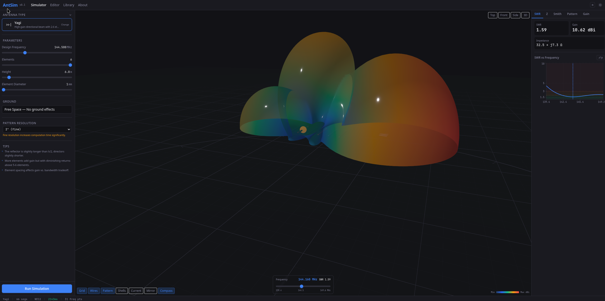
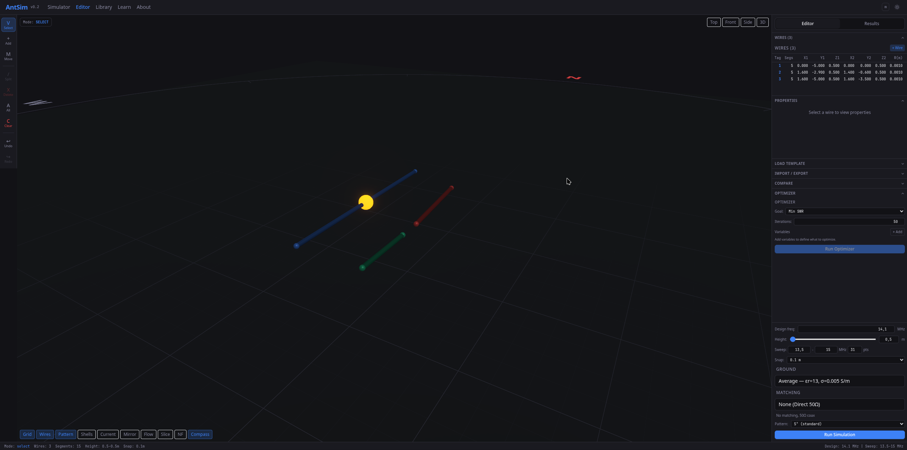

<h1 align="center">AntennaSim</h1>

<p align="center">
  <strong>Free, open-source antenna simulator for the browser -- powered by NEC2</strong>
</p>

<p align="center">
  
  
  
  
  
  
</p>

<p align="center">
  <a href="https://EA1FUO.github.io/AntennaSim/"><strong>Try the live demo</strong></a> &middot; <code>docker run -p 80:80 ea1fuo/antennasim</code>
</p>

<br>

<p align="center">
  
</p>

<p align="center">
  
</p>

<br>

<p align="center">
  <strong>17 antenna templates</strong> &nbsp;&middot;&nbsp;
  <strong>3D radiation patterns</strong> &nbsp;&middot;&nbsp;
  <strong>SWR &amp; Smith charts</strong> &nbsp;&middot;&nbsp;
  <strong>Wire editor + optimizer</strong> &nbsp;&middot;&nbsp;
  <strong>NanoVNA overlay</strong> &nbsp;&middot;&nbsp;
  <strong>Dark / light theme</strong>
</p>

<br>

Design antennas from built-in templates or build your own from scratch in the wire editor. Run NEC2 simulations and instantly visualize SWR, impedance, Smith chart, 3D radiation patterns, current distribution, and near-field heatmaps -- all in your browser.

**Two deployment modes:** self-hosted with Docker (backend + Redis) or fully static via WebAssembly on GitHub Pages -- zero server required.

---

## Quick Start

### Prerequisites

- [Docker](https://docs.docker.com/get-docker/) and [Docker Compose](https://docs.docker.com/compose/install/) (v2+)
- That's it. No Python, Node.js, or nec2c installation needed.

### One-liner (Docker Hub)

```bash
docker run -p 80:80 ea1fuo/antennasim
```

Open **http://localhost** in your browser. Done. This pulls the all-in-one image from Docker Hub with everything bundled (frontend, backend, Redis, nginx).

### From source

```bash
git clone https://github.com/EA1FUO/AntennaSim.git
cd AntennaSim
cp .env.example .env
docker compose up --build
```

The first build takes a few minutes (downloading base images, compiling nec2c, installing dependencies). Subsequent starts are fast.

> Prefer to run it without a server? AntennaSim also runs fully in the browser via WebAssembly -- see the [Deployment guide](docs/deployment.md).

---

## Documentation

Full guides live in the [`docs/`](docs/) folder:

| Guide | What's inside |
|---|---|
| [Usage](docs/usage.md) | Antenna templates, full feature list, keyboard shortcuts |
| [Development](docs/development.md) | Dev setup, local WASM build, architecture, project structure, tech stack |
| [Deployment](docs/deployment.md) | GitHub Pages (WebAssembly) and production Docker deployment |
| [API Reference](docs/api.md) | REST + WebSocket endpoints and configuration (`.env`) |

---

## Highlights

- **17 antenna templates** -- dipoles, verticals, loops, Yagi/Moxon/Hex beams, LPDA, magnetic loop, and more ([full list](docs/usage.md#antenna-templates))
- **Full NEC2 pipeline** -- card deck generation, `nec2c` execution, and parsed results, all automated
- **Interactive 3D viewport** -- radiation patterns, current distribution with animated flow, near-field heatmaps
- **Charts & analysis** -- SWR, impedance, Smith chart, polar pattern, balun/unun matching, NanoVNA `.s1p` overlay
- **Wire editor** -- build arbitrary geometries, import/export `.nec` and `.maa` files
- **Optimizer** -- Nelder-Mead with 5 objective functions and real-time progress

See the [Usage guide](docs/usage.md#features) for the complete feature list.

---

## Contributing

Contributions are welcome -- this is a free and open-source project for the amateur radio community. See [CONTRIBUTING.md](CONTRIBUTING.md) for setup, branch/commit conventions, and how to add an antenna template.

Found a bug or have an idea? Open an [issue](https://github.com/EA1FUO/AntennaSim/issues) or a [discussion](https://github.com/EA1FUO/AntennaSim/discussions).

---

## License

AntennaSim is free software released under the [GNU General Public License v3.0](LICENSE).

You are free to use, modify, and distribute this software. If you distribute modified versions, they must also be released under the GPL-3.0. See [LICENSE](LICENSE) for the full text.

---

## Acknowledgments

- **[NEC2](https://en.wikipedia.org/wiki/Numerical_Electromagnetics_Code)** -- the Numerical Electromagnetics Code developed at Lawrence Livermore National Laboratory. The foundation of antenna simulation for decades.
- **[nec2c](https://www.pa3fwm.nl/software/nec2c/)** -- the C translation of NEC2 by Neoklis Kyriazis (5B4AZ), making NEC2 accessible on modern systems.
- **The amateur radio community** -- for decades of antenna design knowledge, experimentation, and sharing.

---

<p align="center">
  <sub>Built for amateur radio operators, by amateur radio operators.</sub>
  <br>
  <sub>73 de AntennaSim</sub>
</p>
